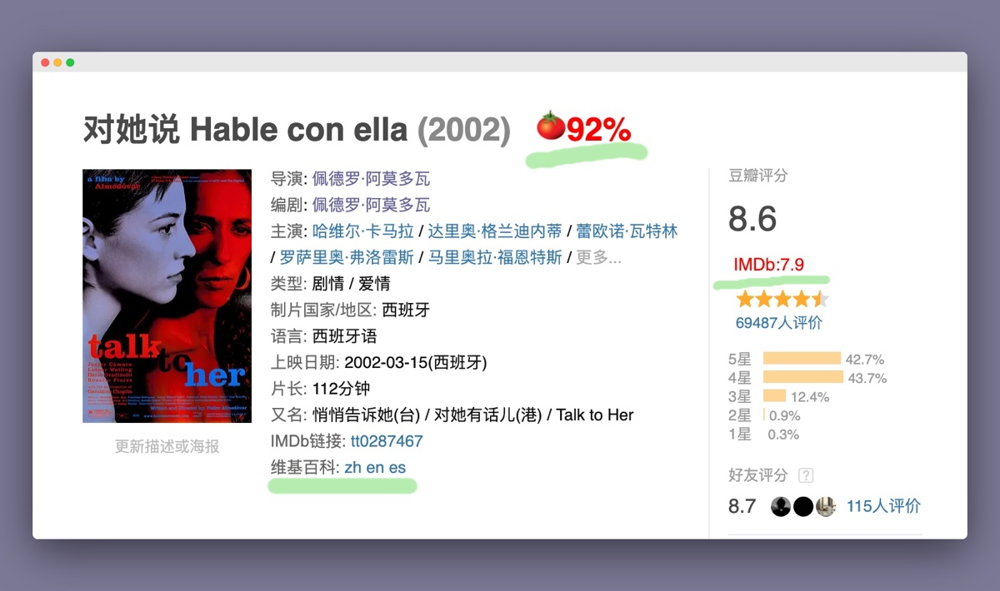
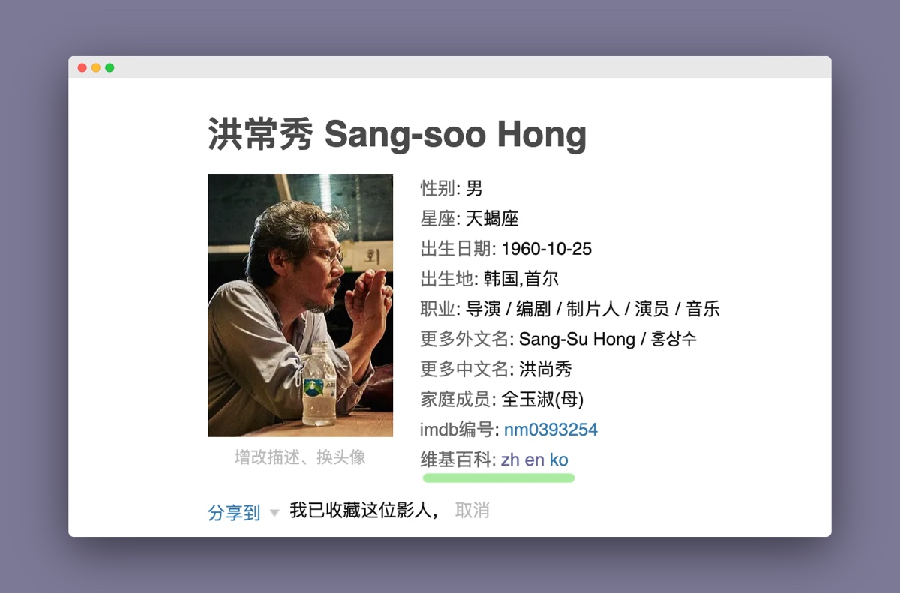

## 🌟Features

* **IMDb** 评分, 以及其在Top 250排名显示
* **烂番茄** 分数显示
* 🆕电影与影人条目页面显示对应的**维基百科**链接
* 可    配置开关以上功能的显示

## 🔧下载安装

<section id="download-section" class="flex flex-column flex-row-ns items-center items-start-ns">
    
    
    
</section>

注: Opera用户将直接使用Chrome Web Store安装。

## 反馈与意见

你可以在通过[表单](https://jinshuju.net/f/3hBRzr)联系我们，或者直接在我们的[Github](https://github.com/lisongx/doubanIMDb/issues)添加issue。
